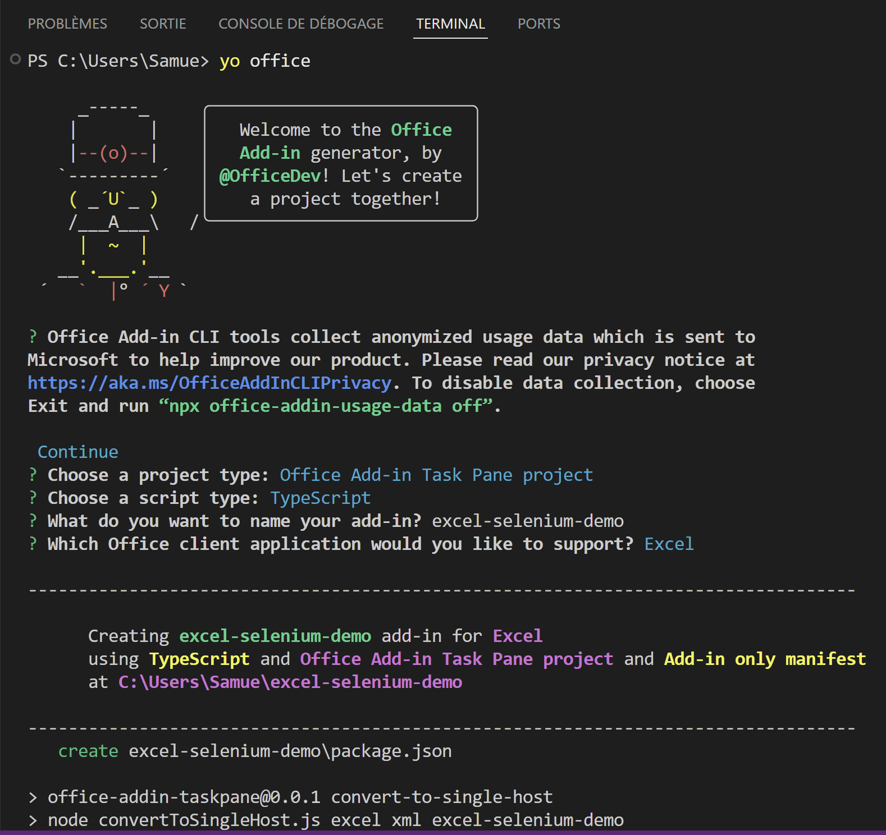
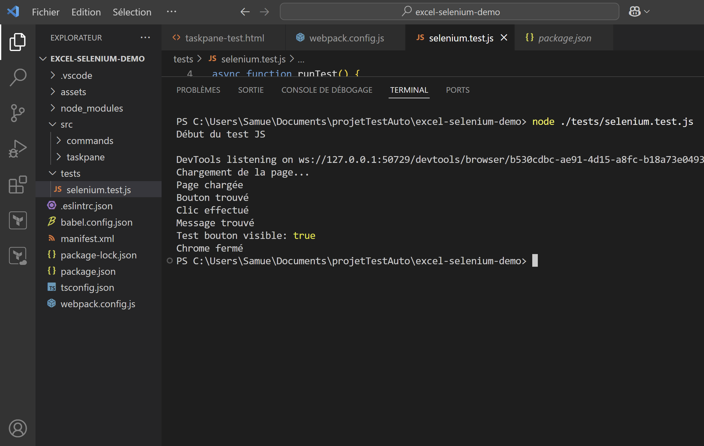
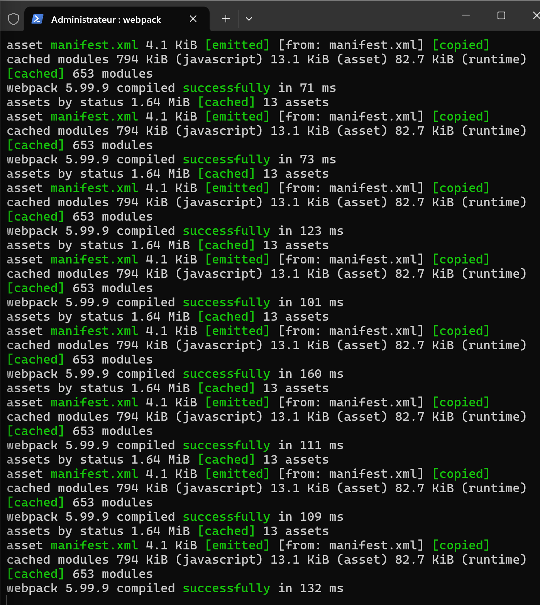
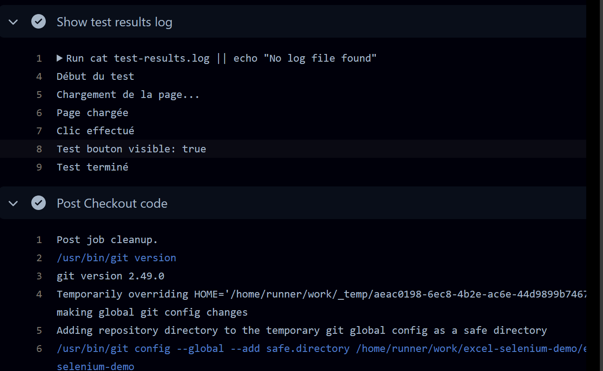
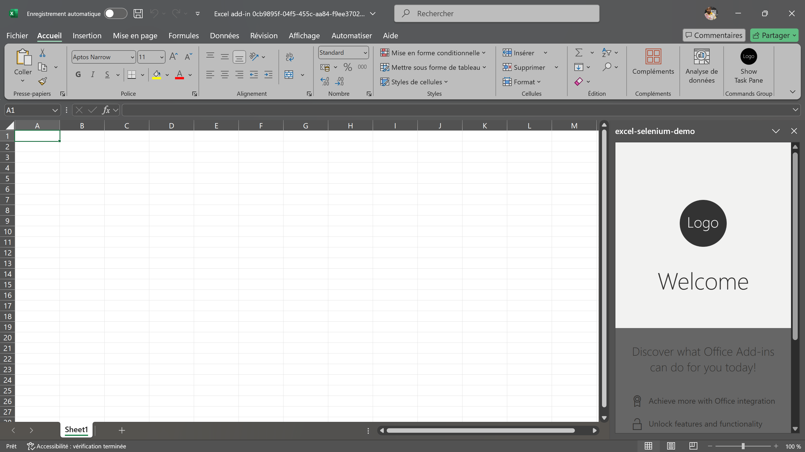
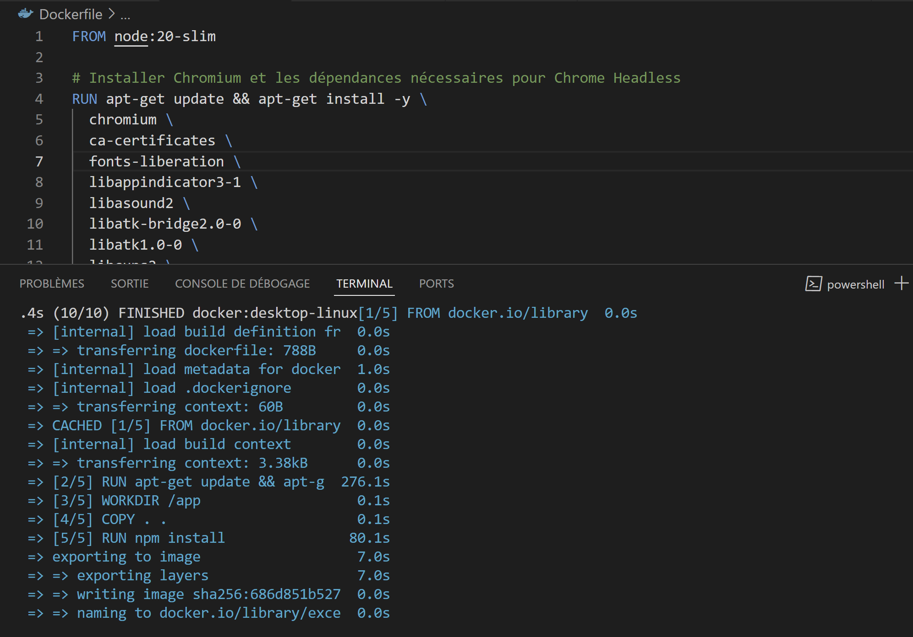

# Excel Selenium Demo


> Projet de démonstration d’un test automatisé Selenium sur un add-in Excel, conteneurisé avec Docker et déployé via CI/CD GitHub Actions.

---

## Sommaire

* [Contexte et Objectif](#contexte-et-objectif)
* [Stack Technique](#stack-technique)
* [Étapes réalisées](#étapes-réalisées)
* [Lancer le projet en local](#lancer-le-projet-en-local)
* [Test automatisé](#test-automatisé)
* [Pipeline CI/CD](#pipeline-cicd)
* [Améliorations possibles](#améliorations-possibles)
* [Apprentissages et points forts](#apprentissages-et-points-forts)
* [Captures d'écran](#captures-décran)

---

## Contexte et Objectif

Ce projet a pour but de créer un add-in Excel simple, puis d’automatiser un test fonctionnel via Selenium WebDriver. L’objectif est de valider le bon fonctionnement de l’add-in par un test de bout en bout dans un environnement Dockerisé, puis d’intégrer ce processus dans un pipeline CI/CD pour automatiser les tests à chaque modification.

---

## Stack Technique

* **TypeScript** : utilisé initialement pour développer l’add-in, mais le script Selenium est en JavaScript pour simplifier l’exécution.
* **Selenium WebDriver** : outil d’automatisation de navigateur pour simuler l’utilisation et vérifier les éléments UI.
* **Docker** : conteneurisation de l’environnement de test (nœud + Chrome headless).
* **GitHub Actions** : pipeline CI/CD déclenchant la construction, le test et la récupération des logs.
* **Webpack** : bundler pour le code front-end de l’add-in.
* **Node.js** : environnement d’exécution JavaScript pour les scripts de test.

---

## Étapes réalisées

1. Création du projet add-in Excel avec Yeoman generator (TypeScript).
2. Construction du serveur local avec Webpack.
3. Écriture d’un script Selenium automatisant l’interaction (clic bouton, vérification affichage).
4. Dockerisation de l’environnement pour exécuter les tests dans un conteneur isolé.
5. Mise en place d’un workflow GitHub Actions pour construire l’image, lancer les tests et récupérer les logs.
6. Gestion des problèmes liés à HTTPS, certificats, ports, et versions des outils.
7. Adaptation du script Selenium en JavaScript pour compatibilité et simplicité d’exécution dans Docker.

---

## Lancer le projet en local

```bash
# Installer les dépendances
npm install

# Démarrer le serveur local pour l'add-in
npm start
```

Ouvrir Excel, activer l’add-in (side-loading), puis accéder à la page de test via `http://localhost:3000/taskpane-test.html`.

---

## Test automatisé

Le script `selenium.test.js` exécute un test fonctionnel qui :

* Charge la page de test de l’add-in.
* Cherche un bouton par son ID.
* Simule un clic.
* Vérifie l’apparition d’un message confirmant le test.
* Log les étapes dans un fichier `test-results.log`.

Le script tourne dans un conteneur Docker avec Chrome en mode headless.

---

## Pipeline CI/CD

Le workflow GitHub Actions :

* Clone le dépôt.
* Construit l’image Docker.
* Lance un conteneur exécutant le test Selenium.
* Récupère le fichier de logs produit par le test.
* Affiche les résultats dans la console de GitHub Actions.

Cela permet une validation automatique à chaque push.

---

## Améliorations possibles

* **Monitoring et reporting** : exporter les logs dans un outil tiers (Elastic Stack, Datadog, etc.).
* **Tests supplémentaires** : étendre la couverture de test avec plus de scénarios.
* **Gestion avancée des erreurs** : snapshots d’écrans sur échec.
* **Optimisation Docker** : réduction de taille d’image, gestion multi-plateforme.
* **TypeScript dans les tests** : faciliter le typage et la maintenance.

---

## Apprentissages et points forts

* Maîtrise de la création d’add-in Office avec TypeScript.
* Usage pratique de Selenium WebDriver pour automatisation UI.
* Conteneurisation complète avec Docker pour tests reproductibles.
* Intégration de la CI/CD via GitHub Actions.
* Résolution de problèmes liés aux certificats HTTPS, ports, versions d’outils.
* Gestion des logs automatisée et extraction dans le pipeline.

---

## Captures d'écran

|               Initialisation du projet Office Add-in               |               Résultat console test local              |
| :----------------------------------------------------------------: | :----------------------------------------------------: |
|  |  |

|               Résultat docker build + test               |                 Log affiché dans GitHub Actions                |
| :------------------------------------------------------: | :------------------------------------------------------------: |
|  |  |

|                     Add-in dans Excel                    |                    Webpack build output                   |
| :------------------------------------------------------: | :-------------------------------------------------------: |
|  |  |

---

